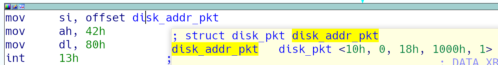
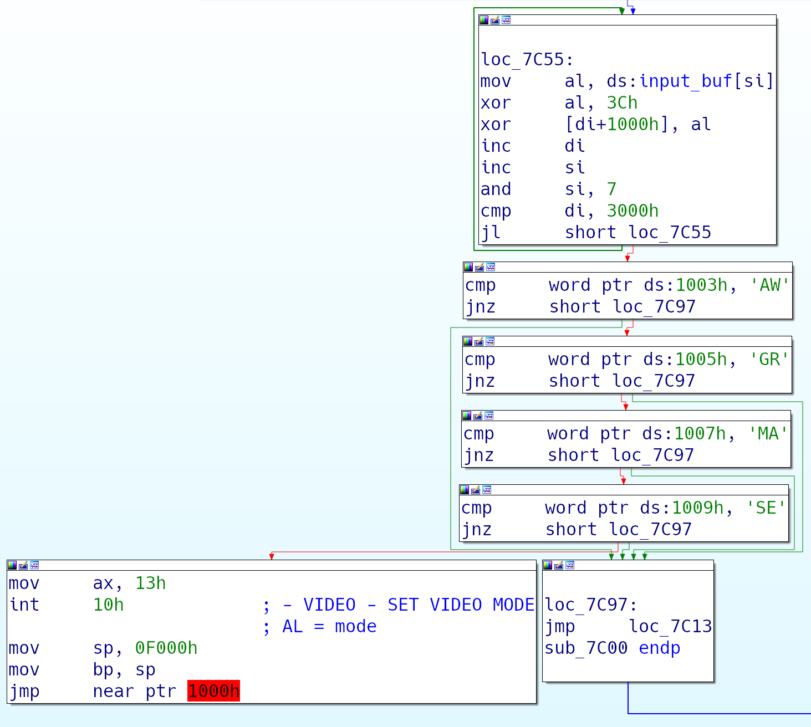

[writeup by @abiondo]

**CTF:** CSAW CTF Final Round 2017

**Team:** spritzers (from [SPRITZ Research Group](http://spritz.math.unipd.it/))

**Task:** reversing / DEFCON 1

**Points:** 50

```
The year is 1981. Matthew Cyber-Broderick (You) finds a bizzare system. Understand it, and decrypt the secret ROM within.

Part 1 of Global Thermonuclear Cyberwar.

Run with qemu-system-i386 -drive format=raw,file=cyberwar.rom

NOTE: The gdbstub in the latest QEMU on ubuntu gave us issues. A known-good version of QEMU is 2.10.1
```

This challenge was the first part of a more difficult one ([Global Thermonuclear Cyberwar](../../pwn/cyberwar)).

We are given a [x86 system image](./cyberwar.rom):

```
$ file cyberwar.rom
cyberwar.rom: DOS/MBR boot sector
```

If we run the image, we're greeted with the following prompt:

```
WOPR SUPERCOMPUTER
THIS IS A CSAW OWNED COMPUTER SYSTEM - ALL ATTEMPTS AT ILLEGAL ACCESS WILL
BE SEVERELY PUNISHED TO THE FULL EXTENT OF THE LAW.
FOR AUTHORIZATION, PLEASE WRITE TO PROF. STEVEN FALKEN.
LOGIN>
```

Okay, let's load the image up in IDA (base and entry point at 0x7C00, 16-bit code).

After setting up the video mode (text 80x25) and printing the prompt, it performs a disk read:



This loads 24 512-byte sectors, starting from sector 1, into memory at 0x1000. After that, it's easy to see the input loop and determine that the input length is 8 bytes. After the input has been acquired, there's the following code:



This decrypts 0x2000 bytes starting from address 0x1000 by repeating key XOR with the input, also single-byte XORed with 0x3C. Then, it checks whether the 8 bytes starting at 0x1003 are equal to `WARGAMES`. If they aren't, it goes back to prompting for a password. On the other hand, if the check passes, it sets the video mode to VGA 320x200 color, sets up the stack pointer to 0xF000 and jumps to 0x1000 (beginning of decrypted code).

Since XOR encryption is used and we know 8 consecutive bytes of the plaintext, we can derive the key (i.e., the input password). I wrote a [small script](./scripts/extract.py) that finds the key and decrypts the whole ROM.

Now the flag's pretty easy to find:

```
$ strings rom_dec | grep -Po 'flag{.*?}'
flag{ok_you_decrypted_it_now_plz_pwn_it!}
flag{__PWN_ON_SERVER_TO_GET_REAL_FLAG__}
```

The first flag is for this challenge. The second one refers to the [second part](../../pwn/cyberwar-350).