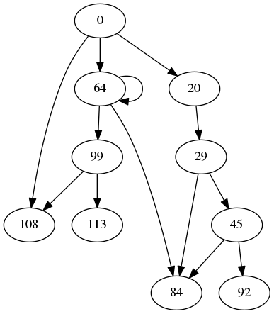
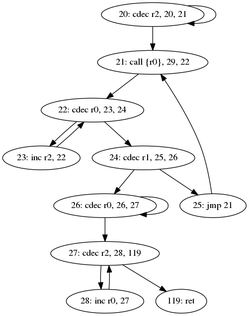

[writeup by abiondo & kenoph]

**CTF:** Google CTF 2017 (Quals)

**Team:** spritzers

**Task:** Reversing / Counting

**Points:** 246

# The challenge

```
This strange program was found, which apparently specialises in counting. In order to find the flag, you need to output find what the output of ./counter 9009131337 is.

Update: Seems we have a minor bug in Counting - 32-bit truncation on getting the argument from command line. To get the flag you need to calculate the result of executing code for the full 64-bit 9009131337 value as the description states. A result for a truncated 32-bit value won't give you the correct result. We apologize for the inconvenience.
```

We are given [two files](./challenge):

```
code:    data
counter: ELF 64-bit LSB executable, x86-64, version 1 (SYSV), dynamically linked, interpreter /lib64/ld-linux-x86-64.so.2, for GNU/Linux 2.6.24, BuildID[sha1]=ac70b7c58cc7989f829c0f0d50431ea0a92cbefb, stripped
```

We don't know what `code` is. Let's try running some inputs:

```
$ for i in 32 33 34 35; do /usr/bin/time -f "%e" ./counter $i; done
CTF{0000000000000075}
2.59
CTF{0000000000000200}
4.10
CTF{0000000000000148}
6.46
CTF{000000000000009d}
10.68
```

That looks like exponential time. Running the program with the provided input isn't going to finish any time soon. Maybe if we figure out what it's calculating we can write a more efficient algorithm for it. Let's get to reversing!

We open it up in IDA and start going through it with the Hex-Rays Decompiler. We quickly figure out we're looking at a VM that loads its bytecode from the `code` file, verifies it's valid and finally executes it. Reversing the VM is quite easy, especially with the decompiler, so we won't be going into the details. Cleaned up and recompilabile source code is [available](./reverse/counter.c).

It is clear now that we'll have to reverse the bytecode. Sounds like fun.

# The VM

The `code` file starts with a 4-byte integer that specifies the number of instructions that follow. Instructions are labeled in the order the appear in the file, so the first one is instruction 0, the second one is instruction 1 and so on. Each instruction is a 16-byte structure with four 4-byte fields:

- **Opcode:** indicates the type of instruction;
- **Operand:** depends on the opcode;
- **Next 1 and 2:** labels of the next instructions to execute.

The VM has 26 64-bit registers, indexed 0 - 25. There are three opcodes (we made up mnemonics for them):

- `INC = (0, reg, next1, _unused_)`: `reg++; goto next1;`
- `CDEC = (1, reg, next1, next2)`: `if (reg > 0) { reg--; goto next1; } else { goto next2; }`
- `CALL = (2, n, next1, next2)`: `r0..r{n-1} = next1(r0, r1, ..., r25); goto next2;`

The first interesting thing to note is that every instruction specifies where to jump next. `INC` is what you would expect it to be, but `CDEC` and `CALL` are tricky.
`CDEC`can be used to implement all sorts of control flows thanks to its conditional statement, while `CALL` has potentially many return values.

The VM stops when it reaches the instruction past the last one, which in our case is 119 (since we have 119 instructions). If it's inside a `CALL`, it returns.

# Preliminary Analysis

Before deciding what to do, we needed to figure out how the instructions are used in the actual bytecode we were given.

The first step was to write a [simple disassembler](./tools/disasm.py) that would output a human-readable version of the bytecode. The output was something like this:

```asm
...
 65: cdec r3, 65, 66 ; Xrefs: 65
 66: cdec r0, 67, 68 ; Xrefs: 67
 67: inc  r3, 66
 68: cdec r3, 69, 119 ; Xrefs: 66
...
```

Using some simple bash kung fu, we were able to immediately figure out which registers are actually used:

```bash
$ grep -oP 'r\d+' code.asm | sort | uniq
r0
r1
r2
r3
r4
r25
```

That `r25` register looks suspicious... Another quick `grep`:

```bash
$ grep 'inc r25' code.asm | wc -l
0
```

So `r25` is never incremented. This is interesting because its initial value is zero, so we can assume `r25 = 0` in the entire program. This allow us to translate code like `CDEC r25, next1, next2` into an uncoditional jump to `next2`.

We can check how many return registers are actually used by calls:

```bash
$ grep -Po '(?<=call {)[^}]*' code.asm | sort | uniq
r0
r0, r1
```

Nice, two at most.

At this point, we were starting to wonder whether to use a manual approach or an automatic one to tackle the challenge. For this reason, we wrote a [small python script](./tools/callgraph.py) to generate the callgraph of the bytecode. Here's the result:



It also generates nice CFGs, for example for the function at 20:



The callgraph doesn't look too bad, but there's some recursion going on. All those simple instructions were messing with our brains. We didn't study CS for this!

# Lifting the bytecode

Being the lazy millennials we are, we clearly needed some(one|thing) to offload the manual work to. We thought of lifting the bytecode to LLVM intermediate language. We then grab (yet another) coffee, let the LLVM optimizers do some unspeakable black magic, and presto! we have greatly cleaned-up IL. There are tools to decompile LLVM IL to C (e.g. fcd, CppBackend), but as always happens during CTFs we either had issues getting them to work or the output wasn't that good. So we trusted that compiling and then feeding it into the decompiler would do. The final tool is available [here](./tools/transllvm.py).

## SSA form basics

The LLVM IL is in SSA (Static Single Assignment) form. If you already know what it is, then you can skip ahead to the next section. Otherwise, bear with us for a moment. SSA means that each variable is assigned exactly once through the whole code. In our case, the registers are variables. When we change the value of a register, what we really do is creating a new variable to which we assign the new value. The current register state keeps track of the most recent version of each register.

There is a small hiccup to be solved. Imagine, at a higher level, you have code like this that you want to transform into SSA form:

```
if (x < 10)
    y = 42;
else
    y = 1337;
do_something(y);
```

When restructured into basic blocks it'll look like:

```
          +-----------+
          |           |
          |  x < 10?  |
          |           |
          +-----+-----+
                |
  true +--------+--------+ false
       |                 |
+------v-----+    +------v-----+
|            |    |            |
|   y = 42   |    |  y = 1337  |
|            |    |            |
+------+-----+    +------+-----+
       |                 |
       +--------+--------+
                |
      +---------v---------+
      |                   |
      |  do_something(y)  |
      |                   |
      +-------------------+
```

This is not in SSA form, since `y` is assigned twice (even though it's in different blocks). We solve this by creating two separate versions of `y`, one for each assignment. But if we use different variables, how do we know which one we should use in the `do_something` block? The answer is that we define a *phi function* that selects a variable based on the predecessor block, like this:

```
          +-----------+
          |           |
          |  x < 10?  |
          |           |
          +-----+-----+
                |
  true +--------+--------+ false
       |                 |
+------v-----+    +------v-----+
|            |    |            |
|  y1 = 42   |    |  y2 = 1337 |
|            |    |            |
+------+-----+    +------+-----+
       |                 |
       +--------+--------+
                |
      +---------v---------+
      |                   |
      |  y = phi(y1, y2)  |
      |  do_something(y)  |
      |                   |
      +-------------------+
```

Where `phi(y1, y2)` takes the value of `y1` if we come from the `true` block, or the value of `y2` if we come from the `false` block.

## Bytecode translation

The lifted code will have to be divided into functions. We mark the beginning of functions at next1 targets of `CALL` instructions. Two properties of the bytecode make this easy:

- all calls to a given function always have the same return registers;
- there are no simple branches to functions.

Since the return register R0 is always present, it's passed back to the caller as the return value. If R1 is also a return register, then the function takes a pointer into which to store it as first argument. Every function also takes the 5 registers at the callsite, passed by value.

For example, a function called by `CALL {R0}, foo, ...` would have this prototype:

```
// Returns r0
int64_t foo(int64_t r0, int64_t r1, int64_t r2, int64_t r3, int64_t r4);
```

While one called by `CALL {R0, R1}, bar, ...` would be like:

```
// Returns r0, stores r1 in *r1_out
int64_t bar(int64_t *r1_out, int64_t r0, int64_t r1, int64_t r2, int64_t r3, int64_t r4);
```

A function is also defined at instruction 0, acting as the bytecode entry point. It's never called and the only branches are like `CDEC R25, 0, X` which, as previously noted, never actually branch to 0.

The lifted code for a function starts by allocating a scratch area on the stack, which will be used later. The current register state for the function is initialized from the passed (by value) registers. We can now generate the actual function body. When we reach a branch to 119, we store R1 into its pointer (if needed) and return R0.

To generate the function body we use an instruction-per-instruction, depth-first exploration strategy. Each instruction marks the beginning of a new basic block. We terminate the previous block with a branch to the new block.

We start the new block with a phi node for each register. The nodes are initialized with a mapping between the edge from the previous block and the current register state. References to the block and its phi nodes are saved for later use (inside the same function). When we encounter a branch to a block that we already translated, we generate a branch to it and add the new incoming edge to its phi nodes, mapping it to the current register state.

Let's now look at how we lift an instruction into the block body.

The `INC` opcode is easy: we just increment the register and go on to translate next1.

For `CDEC` we first check whether we are working with R25: if so, we can just go straight to translating next2 (because R25 is always zero). Otherwise we generate a comparison to check whether the register is zero. If it isn't, we decrement it and (recursively) translate next1. Otherwise, we go on to translate next2.

For `CALL`, we simply generate a call and assign the return value to R0. If the callee also returns R1, we pass it the address of the scratch area as the pointer, and after the call we load R1 from there. This is needed because our local registers are just IL values, which don't have an address.

Since the VM initializes R0 to the input and the other registers to zero, we create an `int64_t entry(int64_t input)` function that initializes the register state and calls the function at 0. It then returns R0, which is the output.

Now, don't think even for a second this was the first algorithm we came up with. We did plenty of idiotic stuff:

- building more versions of LLVM than one should in a year;
- passing registers as arrays, pointers, mixed types, structures and probably something else, too (this affects optimizability);
- forgetting Python constructs mutable default arguments only once;
- messing up phi nodes, in more than one way;
- trying to write an LLVM lifter during a CTF when neither you nor anyone in your team ever touched LLVM IL.

But we knew all about SSA form, so we had that going for us.

# Optimizing the bytecode

Before optimizations, we're looking at 11 functions over 1.3k lines of IL. We enable some aggressive inlining, which allows the other default passes to do wonders in terms of code clean-up (mostly through constant folding, copy propagation and the like). We also run a dead argument elimination pass. After optimizations, we're left with 2 functions (only one of which is recursive) over 150 lines of IL. Not bad, uh? ;)

We found that even with the same optimizations, different LLVM versions produced different output, both at the IL level and (more importantly) when compiled and ran through the decompiler. We'll appeal to Clarke's third law to mask our cluelessness and just say that out of everything we tested, MCJIT from LLVM 3.9 produced the cleanest code once decompiled.

# Reversing the bytecode

Time to crack the [translated binary](./out/code_llvm) open in IDA. This is what the decompiler gives us for `entry`:

```c
int __fastcall entry(unsigned __int64 a1) {
    int result; // eax@2
    __int64 v2; // rsi@3
    unsigned __int64 v3; // r8@3
    __int64 v4; // rcx@5
    unsigned __int64 v5; // r9@5
    unsigned __int64 v6; // rdx@6
    unsigned __int64 v7; // rax@6

    if (a1 >= 11) {
        v2 = 0LL;
        v3 = a1;
        do {
            if (v3 >= 2) {
                v4 = 0LL;
                v5 = v3;
                do {
                    v6 = 0LL;
                    v7 = v5;
                    while (v7) {
                        if (v7 == 1) {
                            v6 = 3 * v5 + 1;
                            break;
                        }
                        v7 -= 2LL;
                        ++v6;
                    }
                    ++v4;
                    v5 = v6;
                } while (v6 >= 2);
                v2 += v4;
            }
        } while (v3-- != 0);
        result = sub_70(a1, v2);
    } else {
        result = 0;
    }
    return result;
}
```

Quotients and remainders are calculated via subtraction loops that are easy to simplify. Let's manually clean it up a bit:

```c
int __fastcall entry(unsigned __int64 n) {
    __int64 v2; // rsi@3
    unsigned __int64 v3; // r8@3
    __int64 v4; // rcx@5
    unsigned __int64 v5; // r9@5
    unsigned __int64 v6; // rdx@6
    unsigned __int64 v7; // rax@6

    if (n < 11)
        return 0;

    v2 = 0;
    v3 = n;
    for (v3 = n; v3 >= 2; v3--) {
        v4 = 0;
        v5 = v3;
        do {
            v6 = v5 / 2;
            v7 = v5 % 2;
            if (v7 == 1)
                v6 = 3 * v5 + 1;
            ++v4;
            v5 = v6;
        } while (v6 >= 2);
        v2 += v4;
    }

    return sub_70(n, v2);
}
```

We can see it's traversing a sequence where the next value *f(x+1)* is *f(x)/2* if *x* is even or *3f(x)+1* if *x* is odd. We recognize that! It's working with [hailstone sequences](https://en.wikipedia.org/wiki/Collatz_conjecture). We can see that `v4` stores the length of the sequence, also known as *total stopping time*. The outer loop is going through all hailstone sequences for 2...*n*, summing all their stopping times into `v2`. Finally, the result is obtained as `sub_70(n, v2)`.

Okay, let's look at `sub_70` now:

```c
signed __int64 __fastcall sub_70(__int64 a1, __int64 a2) {
    signed __int64 result; // rax@1
    signed __int64 v3; // r15@3
    __int64 v4; // rcx@5
    __int64 v5; // rcx@8
    signed __int64 v6; // rdx@9

    result = 0LL;
    if (a1) {
        result = 1LL;
        if (a1 != 1) {
            v3 = sub_70(a1 - 1, a2);
            if (a2) {
                result = v3 + sub_70(a1 - 2, a2);
                do {
                    v4 = 0LL;
                    do {
                        if (result == v4)
                            return result;
                        ++v4;
                    } while (a2 != v4);
                    v5 = 0LL;
                    while (1) {
                        v6 = 0LL;
                        if (!(v5 + result))
                            break;
                        if (!(--v5 + a2)) {
                            v6 = v5 + result;
                            break;
                        }
                    }
                    result = v6;
                } while (a2);
            }
            while (1);
        }
    }
    return result;
}
```

The `while (a2 != v4)` loop returns `result` if `result < a2`. Subtraction loops are used here, too, to calculate a remainder: the big `while (1)` loop subtracts `a2` from `result`. After some cleanup we're left with this:

```c
signed __int64 __fastcall sub_70(__int64 n, __int64 m) {
    signed __int64 result; // rax@1

    if (n == 0)
        return 0;
    if (n == 1)
        return 1;

    while(m == 0);

    result = sub_70(n-1, m) + sub_70(n-2, m);
    return result % m;
}
```

This is a recursive function with base cases `sub_70(0) = 0` and `sub_70(1) = 1`. In the recursive case, it calculates `sub_70(n-1, m) + sub_70(n-2, m)`, then takes it modulo *m*. This is simply the *n*-th [Fibonacci number](https://en.wikipedia.org/wiki/Fibonacci_number) modulo *m*. The infinite loop on `m == 0` makes sense since division by zero is not defined.

We finally know how to generate the output from an input *n*:

1. Calculate *s* as the sum of the total stopping times for all hailstone sequences for 2...*n*;
2. Calculate the result as the *n*-th Fibonacci number modulo *s*.

We wrote a [C program](./tools/solve.c) to find the flag more efficiently. We calculated stopping times the naive way (except we used `(3n + 1)/2` to perform two steps in one) - no caching. For Fibonacci we used a simple iterative solution that runs in linear time with *n*. While there are solutions in logarithmic time, we don't really care as the runtime is heavily dominated by the Collatz loop.

```
$ time ./solve 9009131337 
Sum: 2037448192360
CTF{000001bae15b6382}
./solve 9009131337  2214.60s user 0.04s system 99% cpu 36:57.86 total
```

Profit!

# Conclusion

After this awesome writeup, there's a final question that needs to be answered: **was it worth it to do all of this just to avoid some manual reversing?**

We will never know.

What we do know is that staring at a screen without sleeping much is a recipe for screwing things up... and we also learnt some nice LLVM stuff as a bonus. Now we know kung fu.
