[writeup by @abiondo]

**CTF:** SEC-T CTF 2017

**Team:** spritzers (from [SPRITZ Research Group](http://spritz.math.unipd.it/))

**Task:** rev / Da Vinci

**Points:** 300

```
We got a copy of the Da Vinci virus from the Gibson along with the encrypted credentials to access the tanker fleet and the ransom note. Can you regain control of the tankers before they capsize? 
```

We're given an [archive](./da_vinci.tar.gz) that contains three files:

```
$ file da_vinci/*
da_vinci/a.out:     ELF 64-bit MSB executable, MIPS, MIPS64 rel2 version 1 (SYSV), dynamically linked, interpreter /lib/ld64-uClibc.so.0, stripped
da_vinci/creds.txt: data
da_vinci/ships.txt: ASCII text
```

The `ships.txt` file tells us:

```
[... omitted ASCII art ...]
I have stolen the credentials to your tanker fleet and have taken control of
their ballast systems.
Unless $5 million is transferred to the following account in 7 days,
I will capsize five tankers in the Ellingson fleet.

Name: Mr. Evil Hacker
Address: P.O. Box 105. Road Town, Tortola British Virgin Islands
Concept: Ships c43a7aa9abc036ac4bf8490b0f30a5a7
IBAN: VG96 BEVC 0000 0123 4567 8901
SWIFT: BEVCVGV1XXX
```

The `creds.txt` file looks like encrypted gibberish. Let's crack the ELF binary open in IDA and see what it does. The readers that are not familiar with MIPS might want to keep a MIPS64 instruction reference on hand, and remember that MIPS makes use of *delay slots*: the instruction following a jump is executed **before** the jump. This is a way to optimize the pipeline and avoid stalls. Enough with the architectural lesson, let's get to work.

Here's how `main` begins:

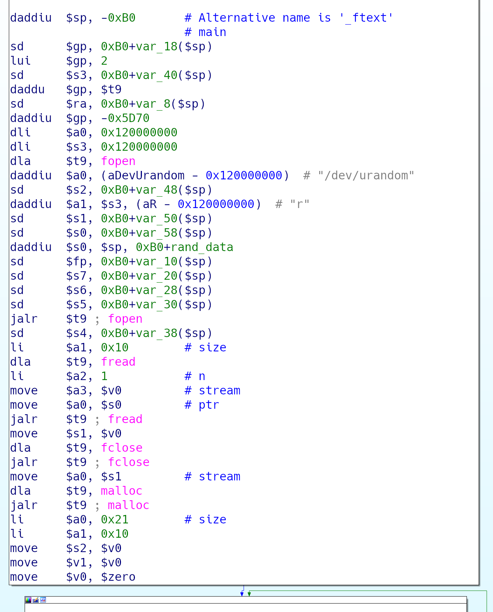

The first thing the program does is reading 16 bytes from `/dev/urandom` and storing them into a stack buffer I named `rand_data`, pointed to by `$s0`. Then, it allocates 33 bytes on the heap and points `$s2` to them. Let's go forward:

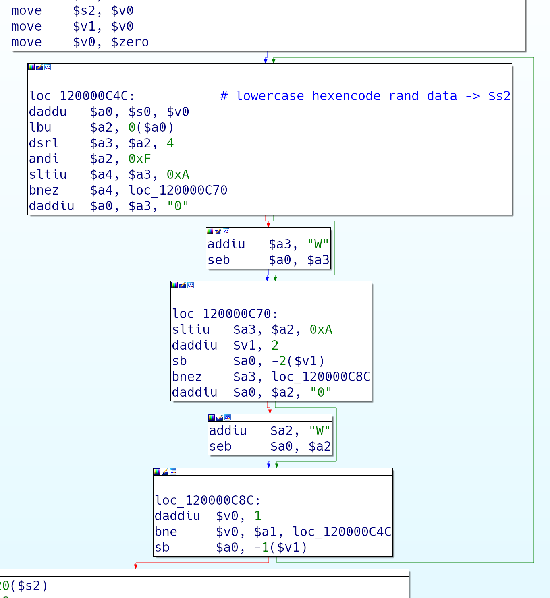

This loop goes over the random bytes, extract nibbles from them and sums with one of two printable characters, depending on whether the nibble is less than 10, storing the resulting bytes in the heap buffer. From a high-level description like that, one might guess this is an hex encoding loop, and indeed it is (`'W' + 10 = 'a'`). The heap buffer now contains the hexencoded random bytes.

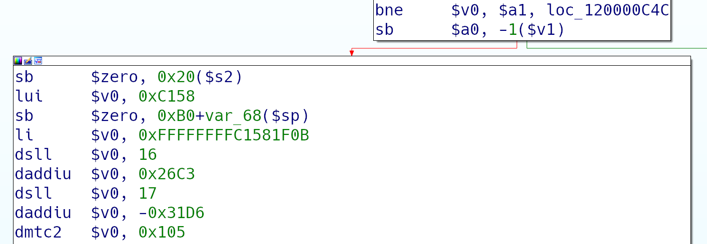

The first instruction zero-terminates the hexencoded buffer. Then, the code constructs a 64-bit value into `$v0` with a series of immediate loads, shifts and additions. This kind of pattern is common in MIPS (both 32 and 64 bits) because instructions have a fixed 4 byte size, so they can't encode a full register-wide immediate value.

Finally, the real point of this task comes up with the `dmtc2` instruction. It moves a 64-bit general purpose register (`$v0`) into a Coprocessor 2 register (`0x105`). There is also a companion instruction, `dmfc2`, that moves from a Coprocessor 2 register into a GP register. The problem is that Coprocessor 2 is implementation defined: to know what those registers mean, we need to figure out exactly what CPU we're running on. By googling the instruction along with register numbers that appear all over the code I found some Linux kernel patches that pointed towards it being a Cavium OCTEON processor, which has a Coprocessor 2 that deals with crypto stuff. The full details are not in open-source code and Cavium doesn't offer its reference manuals publicly, but I was able to find a preliminary Hardware Reference Manual for the OCTEON Plus CN50XX (Google it! :P).

Armed with the manual, we now know that `0x105` is the register for the second quadword of the AES key for the AES unit. There are four AES key registers (`0x104` through `0x107`), because the key is 32 bytes and each register holds 8. We'll likely need this key later, so let's drop a comment and go ahead:

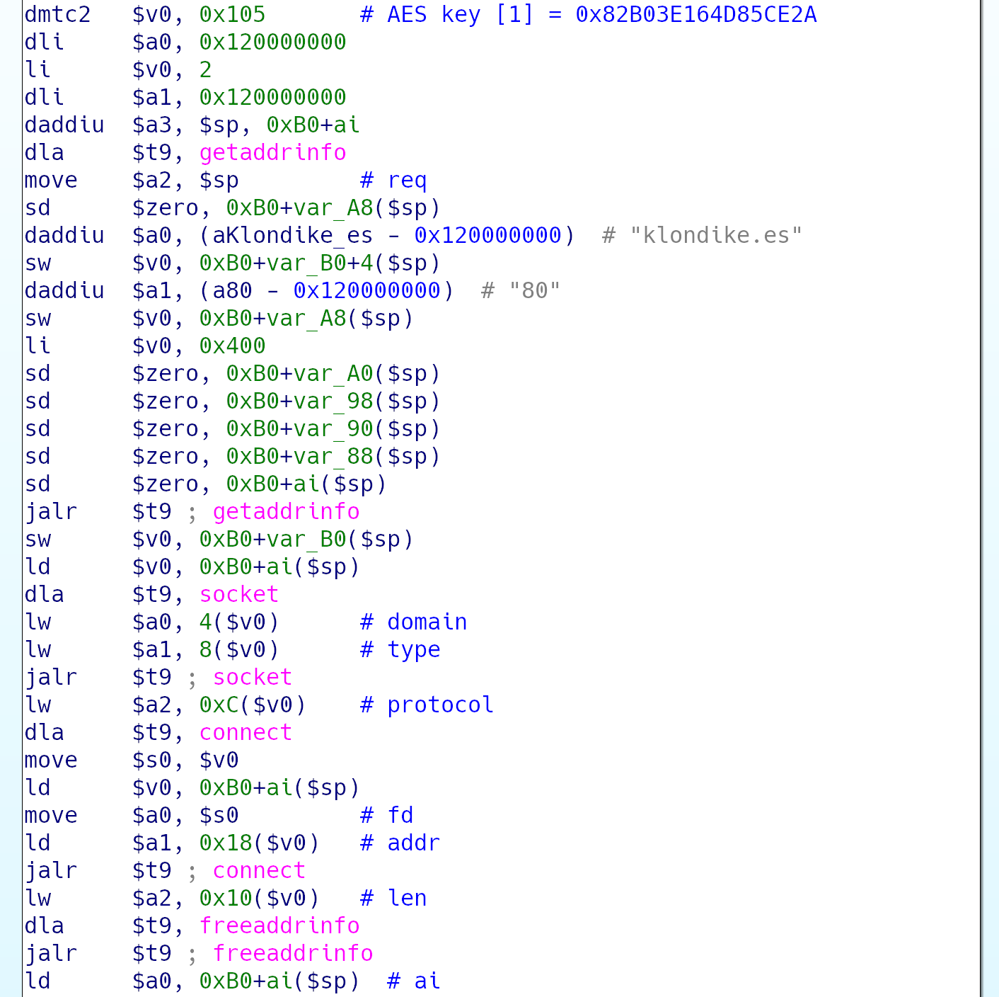

The program is connecting to `klondike.es` on port 80, so we'll probably be looking at an HTTP request next.

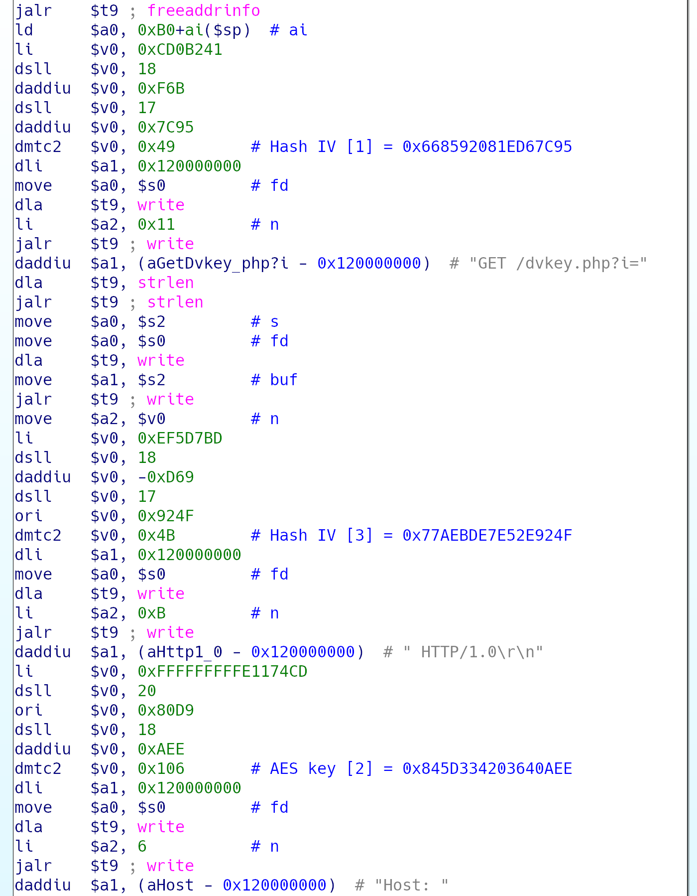

It's now sending a GET request for `/dvkey.php`. The query parameter `i` is the hexencoded random string (remember, it was pointed to by `$s2`). While sending the request, it's also further initializing the coprocessor, setting another quadword of the AES key and a couple IVs for the hash unit. Those IVs form the initial hash value for the function and it's common for crypto coprocessors to not store them directly but rather have them set by the programmer. They're usually standardized, but googling those doesn't yield anything. Custom values, maybe?

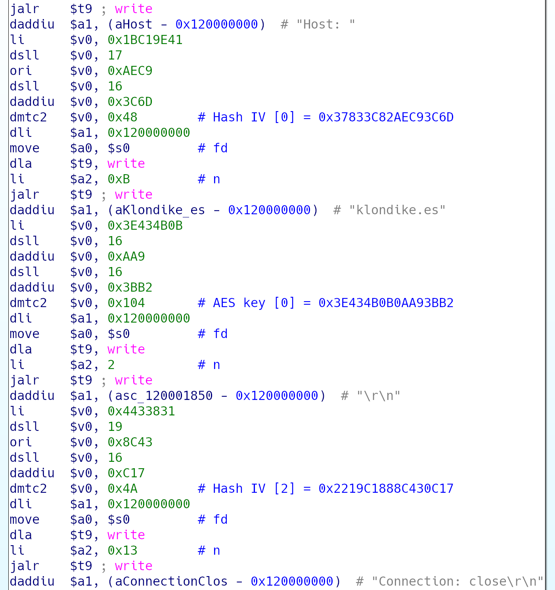

More HTTP stuff and more crypto initialization.

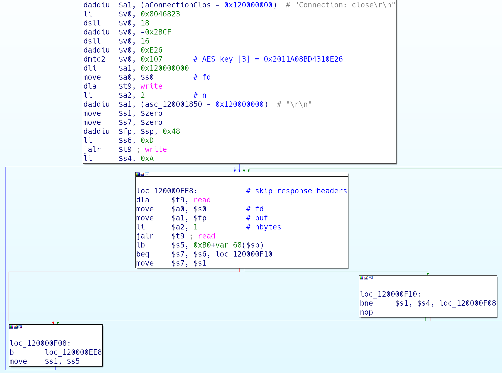

Another AES key quadword set, and finally the HTTP request gets completed. Then the code skips the response headers by looking for two `\r\n` sequences in succession (the missing part is shown in the next image, it'd have been too wide).

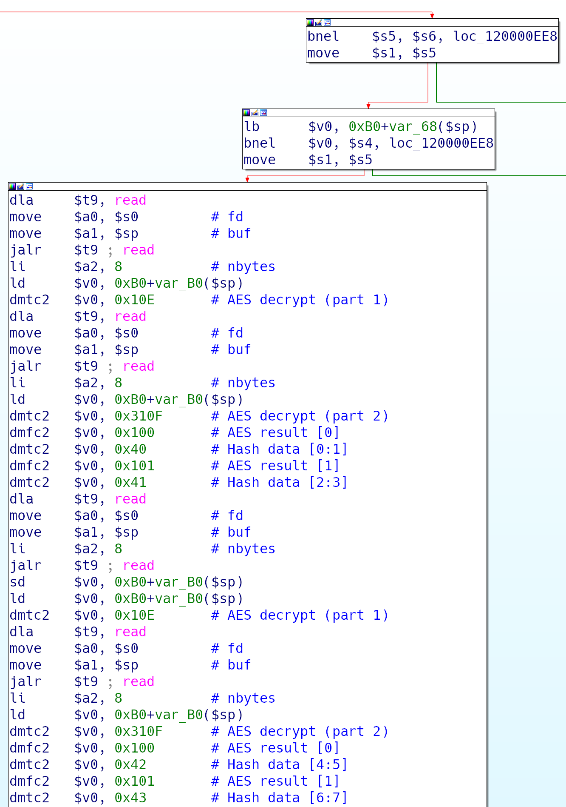

Now it's doing something interesting. It reads 16 bytes (AES block size) in two 8 byte halves, and performs AES ECB decryption on the block with the previously set keys. The way AES works on this coprocessor is that the first 8 bytes are written to a part 1 register, then the second 8 are written to a part 2 register which triggers decryption. The plaintext is split between two 8-byte result registers and fed as data into the hash unit. Then the same operation is repeated on another 16 bytes of HTTP data, with the AES result being stored in consecutive hash data registers.

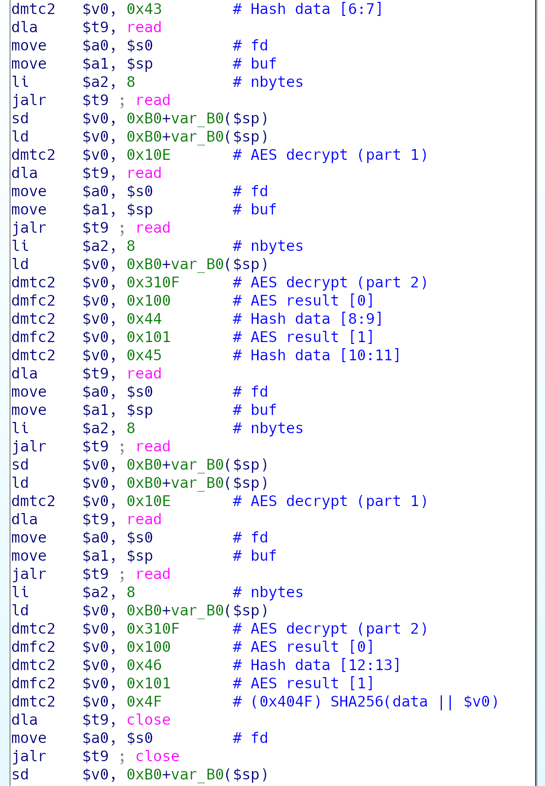

Another two 16 byte blocks are decrypted and fed to the hash unit, for a total of 64 bytes of data. Finally, the decrypted data is hashed with SHA256. Note that the last 8 input bytes are fed via the register that triggers hashing. The manual says that this should be register `0x404F`, but the organizers gave an hint during the CTF saying to consider `0x4F` as `0x404F`. Now that we know what the hash function is, we see that the IVs used by this program are not the usual ones specified by the FIPS 180-4 standard. Another important thing to note is that this hash does not include padding. The standard requires messages to be padded before being hashed, but crypto coprocessors like this only handle the hashing, while padding is left to the software. This means that if we take an off-the-shelf SHA256 implementation and hack the custom IVs into it we won't get the same results as the coprocessor, because the OTS code will add padding. Our data size makes hacking OTS code easier: we have exactly 512 bits (SHA256 block size), so all the padding will be in a new block. We don't need to hack padding away, but just to take the engine state prior to hashing the last block.

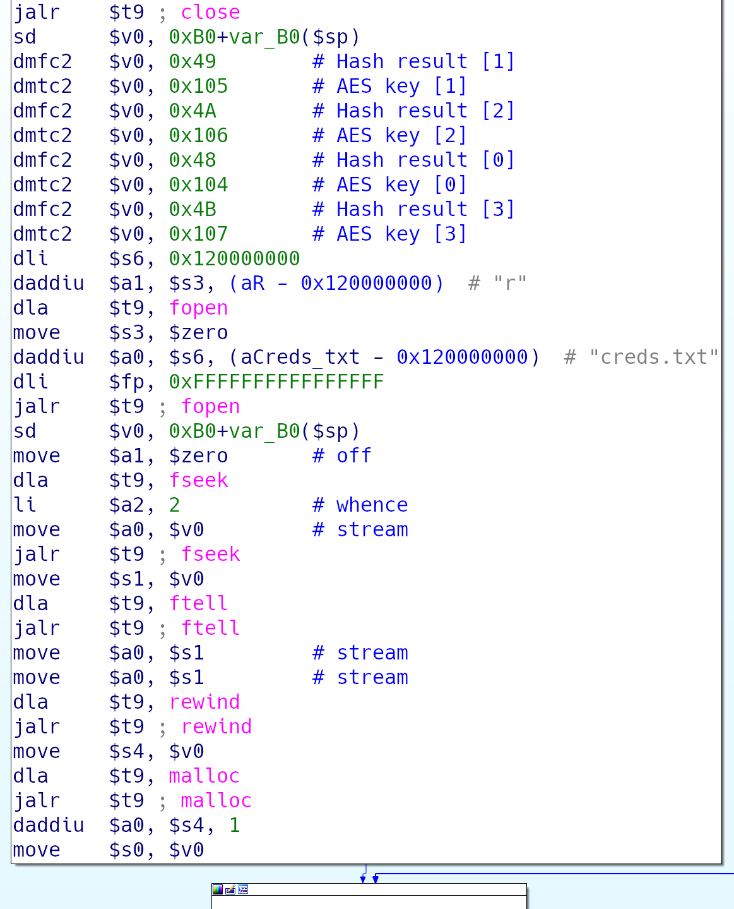

The SHA256 hash is now set as the new AES key. You might notice that those hash result registers are, in fact, the hash IV registers. That's because those registers keep the current hash value, which is initialized with the IVs. The program opens `creds.txt` for reading, determines its size and allocates a heap buffer big enough to hold it. Presumably those are the plaintext credentials that have been encrypted.

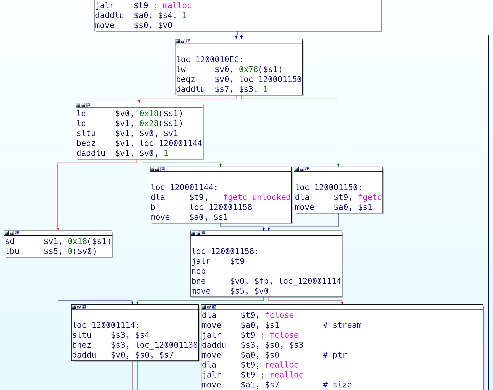

The file is now read into the buffer (some code relative to this is in the next image).

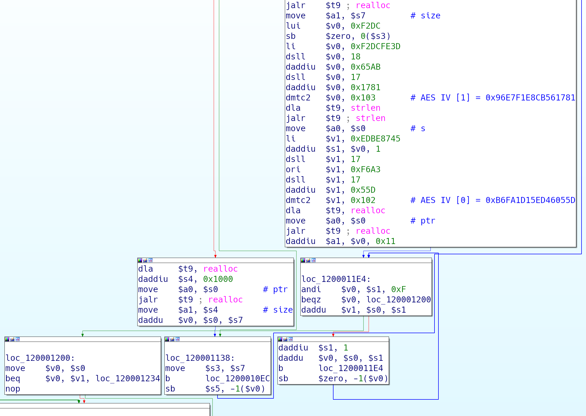

The program sets up the AES IV, as it's going to use it in CBC mode later on. 

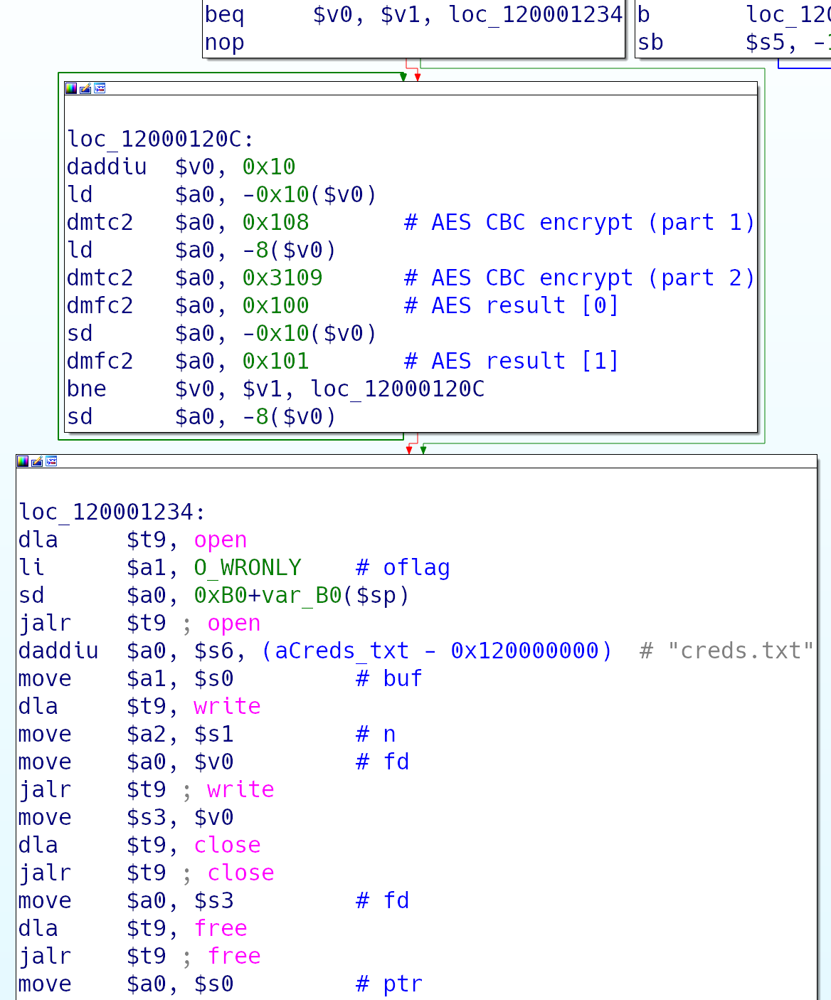

The whole credentials buffer is encrypted with AES CBC, then it's written back to `creds.txt`.

Okay, so now we know how the credentials are encrypted. Send the random 16-byte to the server, get 64 encrypted bytes back, decrypt those with hardcoded keys. Then use the unpadded SHA256 (with custom hardcoded IVs) hash as an AES key together with the hardcoded AES IV to CBC encrypt the credentials. If we can figure out what random value was chosen when our credentials were encrypted, we can do the request/decrypt/hash dance to get the keys, and finally decrypt the file. Hmm, how do we get the random value? Maybe they gave it to us in `ships.txt`? I remembered this line:

```
Concept: Ships c43a7aa9abc036ac4bf8490b0f30a5a7
```

That sure looks like 16 hexencoded bytes. If they actually are the random value, `ships.txt` must be generated further down in the code. Let's pick up where we left off:

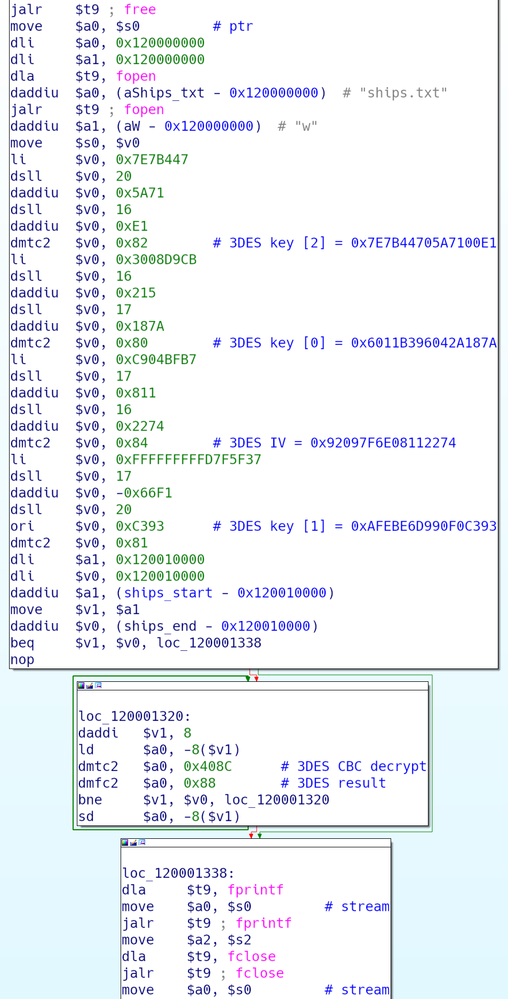

Sure enough, it's opening `ships.txt` for writing. Then, it sets up 3DES keys and IV and decrypts a buffer (which I renamed to `ships_{start,end}`) in CBC mode. Finally, it writes the decrypted buffer into the file using `fprintf`. The first format argument is the third argument to that function. We have `move $a2, $s2`, and `$s2` still points to the hexencoded string. At this point, I decided to write a small script to decrypt the ships buffer. Why? Two reasons. First, I wanted to check that there was indeed a format specifier in there, just to be sure the coder wasn't messing with us. Second, I wanted to test the crypto. We have keys split in pieces, and we must recombine them properly. If we mess it up here, we'll know as it won't decrypt to ASCII text, and we can figure out how to do it properly. We can't do that with the server or credentials data, as we don't know what they're supposed to decrypt to (and there's much more that could go wrong). Since the architecture is big endian, I just tried treating the key pieces as big endian and combining them in order:

```python
#!/usr/bin/python2

import struct
from Crypto.Cipher import DES3

KEYS = [0x6011B396042A187A, 0xAFEBE6D990F0C393, 0x7E7B44705A7100E1]
IV = 0x92097F6E08112274

with open('da_vinci/a.out', 'rb') as f:
    f.seek(0x2010)
    ships = f.read(0xE28)

key = struct.pack('>QQQ', *KEYS)
iv = struct.pack('>Q', IV)
des = DES3.new(key, DES3.MODE_CBC, iv)
print(des.decrypt(ships))
```

It worked:

```
[... omitted ASCII art ...]
I have stolen the credentials to your tanker fleet and have taken control of
their ballast systems.
Unless $5 million is transferred to the following account in 7 days,
I will capsize five tankers in the Ellingson fleet.

Name: Mr. Evil Hacker
Address: P.O. Box 105. Road Town, Tortola British Virgin Islands
Concept: Ships %s
IBAN: VG96 BEVC 0000 0123 4567 8901
SWIFT: BEVCVGV1XXX
```

There we go, a `%s` specifier right where we expected it. I sent a request to the server for `c43a7aa9abc036ac4bf8490b0f30a5a7`, and saved the [data](./dvkey/dvkey) it gave back (turns out, it decrypts to random gibberish). Now it's just a matter of implementing the key derivation and decryption. I used the [SHA256 implementation from Thomas Dixon](https://github.com/thomdixon/pysha2/blob/master/sha2/sha256.py). Padding is added when `digest` is called, but I never call it: I feed the data, which causes the hash to be updated because it's a full block, and then dump the hash from the internal `_h` state. Here's the final script:

```python
#!/usr/bin/python2

import struct
from Crypto.Cipher import AES
from sha256 import sha256

with open('dvkey/dvkey', 'rb') as f:
    dvkey = f.read()

with open('da_vinci/creds.txt', 'rb') as f:
    creds = f.read()

DVKEY_KEYS = [
    0x3E434B0B0AA93BB2, 0x82B03E164D85CE2A,
    0x845D334203640AEE, 0x2011A08BD4310E26]
dvkey_key = struct.pack('>QQQQ', *DVKEY_KEYS)
dvkey_aes = AES.new(dvkey_key, AES.MODE_ECB)
dvkey_plain = dvkey_aes.decrypt(dvkey)

sha256._h = (
    0x37833C82, 0xAEC93C6D, 0x66859208, 0x1ED67C95,
    0x2219C188, 0x8C430C17, 0x77AEBDE7, 0xE52E924F)
dvkey_plain_sha = sha256(dvkey_plain)
creds_key = struct.pack('>IIIIIIII', *dvkey_plain_sha._h)

CREDS_IVS = [0xB6FA1D15ED46055D, 0x96E7F1E8CB561781]
creds_iv = struct.pack('>QQ', *CREDS_IVS)
creds_aes = AES.new(creds_key, AES.MODE_CBC, creds_iv)
creds_plain = creds_aes.decrypt(creds)

print(creds_plain)
```

And we get the flag:

```
Hai!

[...]

Ohh you wanted the password for the oil tanker's ballast system, true?
SECT{C0M3_S41L_7H3_5345_W17H_0UR_74NK3R5!}

Enjoy!
Klondike
```

Thanks for the great challenge!